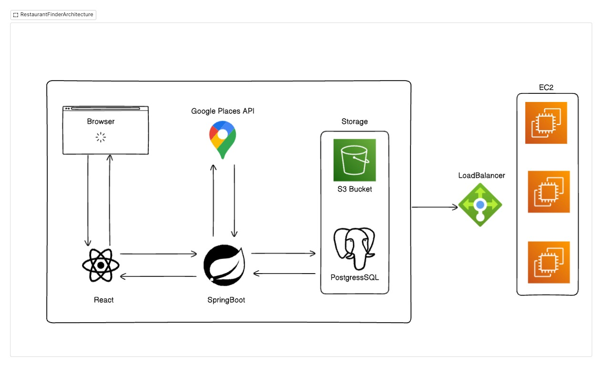
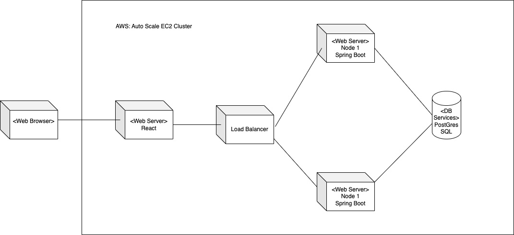

# Bite Check

A brief introduction to the project, its purpose, and the problem it solves.

---

## Table of Contents
1. [Architecture Overview](#architecture-overview)
2. [UML Diagrams and Other Diagrams](#uml-diagrams-and-other-diagrams)
3. [Design Patterns](#design-patterns)
4. [Design Decisions](#design-decisions)
5. [Feature Sets](#feature-sets)
6. [API Documentation](#api-documentation)
7. [Project Setup](#project-setup)
8. [License](#license)

---

## Architecture Overview

### System Architecture
Provide a high-level overview of the system's architecture, including:
- Components
- Services
- Databases
- External integrations

For example:

```plaintext
Frontend ↔ Backend ↔ Database
```

Include a diagram (e.g., an image of your architecture).



---

## UML Diagrams and Other Diagrams

### Deployment Diagram
Deployed in AWS with a Load Balancer with single DB sharing nodes. 



---

## Design Patterns

### Applied Patterns
Design Patterns followed:
- **Singleton**: Used for ensuring a single instance of the configuration manager.
- **Observer**: Used for event-driven architecture in the frontend.
- **Factory**: Simplifies object creation for various API responses.

---

## Design Decisions

### Key Decisions
- **Database Choice**: Chose PostgreSQL for its relational features and scalability.
- **Framework**: Selected React.js for the frontend due to its component-based architecture.
- **API Design**: Followed RESTful principles for easy integration.
- **Backend Framework**: The project utilizes Spring Boot as the backend framework, evident from the presence of pom.xml and directories like src/main/java. Modular design with distinct directories for controllers, services, repositories, and configuration, adhering to clean architecture principles.
- **Security**:Implementation of JWT-based authentication (JwtUtil and JwtAuthenticationFilter). Security configurations are encapsulated in SecurityConfig.java.
- **Database Interaction**: Utilizes JPA repositories (UserRepository, RestaurantRepository) for ORM. Supports search and filtering features via complex queries (SearchCriteria models and DTOs).
- **API Integration**: Integrated with third-party APIs like Google Maps (MapsApiService), as evident from service files handling API responses.
- **Documentation**: Swagger integration (SwaggerConfig.java) for API documentation and testing.


---

## Feature Sets
Overall Feature Set:
1. User Authentication and Authorization:
    * Includes user management and authentication mechanisms.
    * Role-based access to resources, managed in services like CustomUserDetailsService.
2. Restaurant Management:
    * Comprehensive models for restaurants, including details, categories, and operating hours.
    * Admin and business owner features for restaurant management (AdminRestaurantService, BusinessOwnerRestaurantService).
3. Reviews and Feedback:
    * Features for users to add reviews, with validation for duplicate entries (ReviewService, DuplicateReviewException).
4. Search and Discovery:
    * Advanced restaurant search functionalities with filters (RestaurantSearchService, SearchCriteria).
5. File Uploads:
    * File handling capabilities for assets like restaurant images (FileUploadService, AWS S3 configurations).
6. Error Handling:
    * Custom exception handling through GlobalExceptionHandler and specific advisors for different modules

### Key Features
List the core features of your project with brief descriptions:

1. **User Authentication**: Secure login and registration using OAuth2.
2. **Data Visualization**: Real-time graphs and charts for insights.
3. **Role Management**: Fine-grained role-based access controls includes USER,ADMIN,BUSINESS.
4. **Search and Filtering**: Advanced search capabilities with filters like cusines , categories, raitings, pricing.

---

## API Documentation

The complete API documentation is available [here](https://project-5587.postman.co/workspace/a96482d9-acfd-4cca-8858-0fc44fb2fe3b/documentation/40101678-aa931dee-5df7-416e-b580-167c656300af).

## Project Setup

### Prerequisites
- **Node.js** v16+
- **PostgreSQL** v14+
- Other dependencies specified in `package.json`.

### Installation Steps

1. Clone the repository:

2. Install dependencies:
   ```bash
   npm install
   ```

3. Configure environment variables:
   Create a `.env` file based on `.env.example`.

4. Start the server: 
   ```bash
   npm run start
   ```

5. Run tests:
   ```bash
   npm run test
   ```

#### Backend Setup
   ```bash
   mvn clean install
   ```
---

## Team Progress
Project journal [here](./documentation/ProjectJournal-202.pdf)
XP values [here](./documentation/XPvalues.pdf)
Burn Down Task [here](./documentation/202burn.pdf)
Wire Frames [here](./documentation/wireframes.png)
## License

This project is licensed under the MIT License. See the [LICENSE](LICENSE) file for details.
